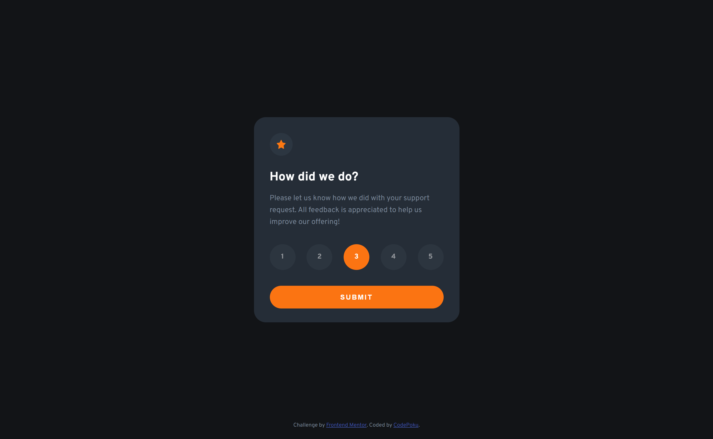

# Frontend Mentor - Interactive rating component solution

## Table of contents

- [Overview](#overview)
  - [Screenshot](#screenshot)
  - [Links](#links)
- [My process](#my-process)
  - [Built with](#built-with)
- [Author](#author)

## Overview

- This is a Frontend Mentor challenge project where we had to create interactive rating component as close to mockups as possible.

### Screenshot

### Links

- Live Site URL: [Site](https://codepoku7.github.io/Interactive-rating-component/)

## My process

- Started up as taking the mockups and slicing up the layout in Figma. Then wrote the HTML and added CSS properties. Finally wrote Javascript functionality and added responsiveness.

### Built with

- Semantic HTML5 markup
- CSS custom properties
- Flexbox
- Media Queries
- Javascript

## Author

- Frontend Mentor - [@CodePoku7](https://www.frontendmentor.io/profile/CodePoku7)
